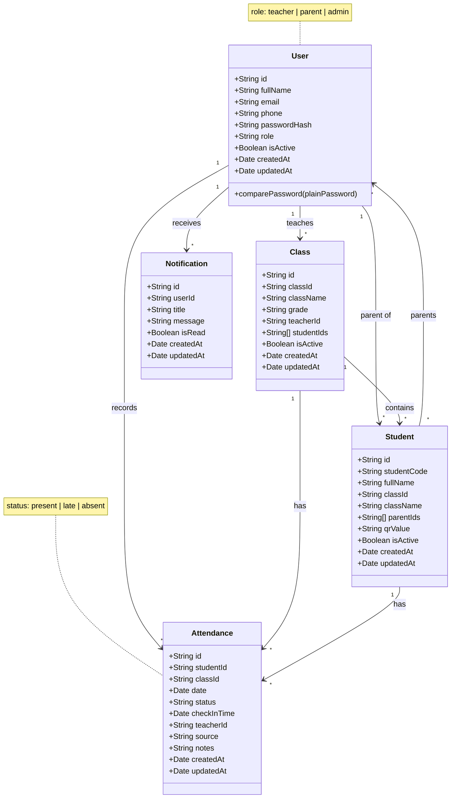

```mermaid
classDiagram
    class User {
        +String id
        +String fullName
        +String email
        +String phone
        +String passwordHash
        +String role
        +Boolean isActive
        +Date createdAt
        +Date updatedAt
        +comparePassword(plainPassword)
    }

    class Student {
        +String id
        +String studentCode
        +String fullName
        +String classId
        +String className
        +String[] parentIds
        +String qrValue
        +Boolean isActive
        +Date createdAt
        +Date updatedAt
    }

    class Class {
        +String id
        +String classId
        +String className
        +String grade
        +String teacherId
        +String[] studentIds
        +Boolean isActive
        +Date createdAt
        +Date updatedAt
    }

    class Attendance {
        +String id
        +String studentId
        +String classId
        +Date date
        +String status
        +Date checkInTime
        +String teacherId
        +String source
        +String notes
        +Date createdAt
        +Date updatedAt
    }

    class Notification {
        +String id
        +String userId
        +String title
        +String message
        +Boolean isRead
        +Date createdAt
        +Date updatedAt
    }

    User "1" --> "*" Class : teaches
    User "1" --> "*" Student : parent of
    User "1" --> "*" Attendance : records
    User "1" --> "*" Notification : receives
    Class "1" --> "*" Student : contains
    Class "1" --> "*" Attendance : has
    Student "1" --> "*" Attendance : has
    Student "*" --> "*" User : parents

    note for User "role: teacher | parent | admin"
    note for Attendance "status: present | late | absent"
```
